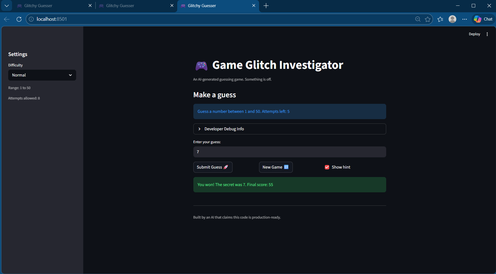

# 🎮 Game Glitch Investigator: The Impossible Guesser

## 🚨 Project Overview

This project involved debugging and repairing a broken number guessing game that was originally generated by AI. The game was built using Streamlit, but several parts of the logic were incorrect, which made the game difficult or impossible to play correctly.

The goal of the assignment was to investigate the bugs, understand why they were happening, fix the issues, and document the debugging process.

---

## 🛠️ Setup

1. Install dependencies:

2. Run the application:

3. Open the game in your browser:

---

## 🎯 Purpose of the Game

The purpose of the game is to guess a secret number within a limited number of attempts. The player selects a difficulty level and then enters guesses. The game provides hints telling the player whether they should guess higher or lower until they either find the correct number or run out of attempts.

---

## 🐞 Bugs Found During Investigation

When the game was first run, several issues appeared:

- The higher/lower hint logic was reversed. When a guess was too high, the game sometimes told the player to go higher instead of lower.
- The difficulty settings were inconsistent. The "Normal" difficulty used a larger number range than "Hard", which made Normal harder than Hard.
- Starting a new game did not properly reset the game state and ignored the selected difficulty range.
- The secret number was sometimes treated as a string instead of an integer, which caused incorrect comparisons.

These issues made the game confusing and unreliable to play.

---

## 🔧 Fixes Applied

Several fixes were implemented to repair the game:

- The higher/lower hint logic was corrected so the hints now match the guess correctly.
- The difficulty ranges were adjusted so that Easy, Normal, and Hard increase logically in difficulty.
- The "New Game" button now resets the score, attempts, history, and secret number correctly.
- The secret number is always treated as an integer to prevent incorrect comparisons.
- Game logic functions were refactored into `logic_utils.py` to separate the UI from the core logic.

---

## 🤖 AI Tools Used

AI tools were used to help review and understand the code during debugging.

Claude was used to help analyze the original logic and suggest possible fixes. GitHub Copilot was also used in VS Code to review functions and assist with generating test cases.

All suggested changes were reviewed and tested before being applied to the final version of the code.

---

## 🧪 Testing

Automated tests were written using `pytest` to verify the behavior of the core game logic functions. These tests check functions such as:

- `get_range_for_difficulty`
- `parse_guess`
- `check_guess`
- `update_score`

Running the following command confirms that the logic behaves correctly:

---

## 📸 Demo

The game runs successfully in Streamlit and allows the player to correctly guess the secret number with accurate hints and scoring.

Example of the fixed game running in Streamlit.

---

## 📚 What I Learned

This project showed that AI-generated code can appear correct at first glance but still contain hidden logic errors. Debugging required carefully reading the code, testing different scenarios, and verifying fixes with automated tests.

Using tools like pytest and separating logic into modules made the debugging process easier and improved the overall structure of the project.